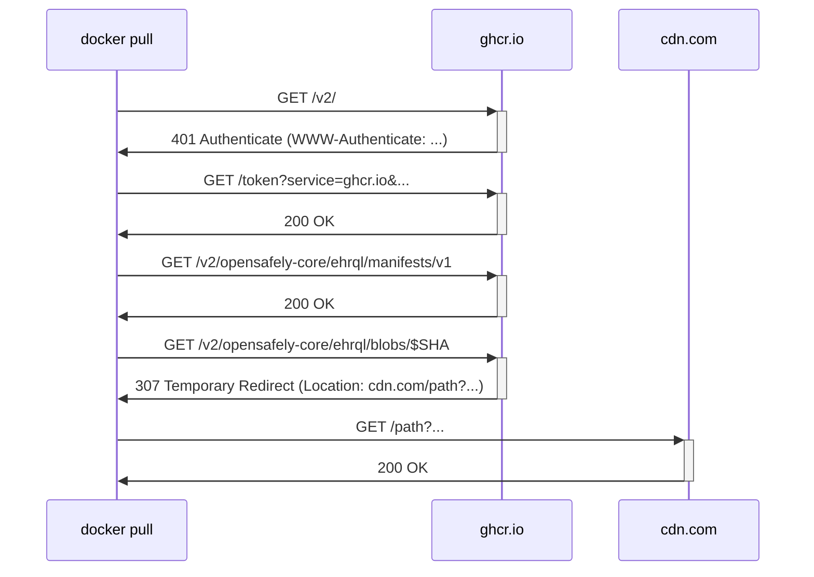
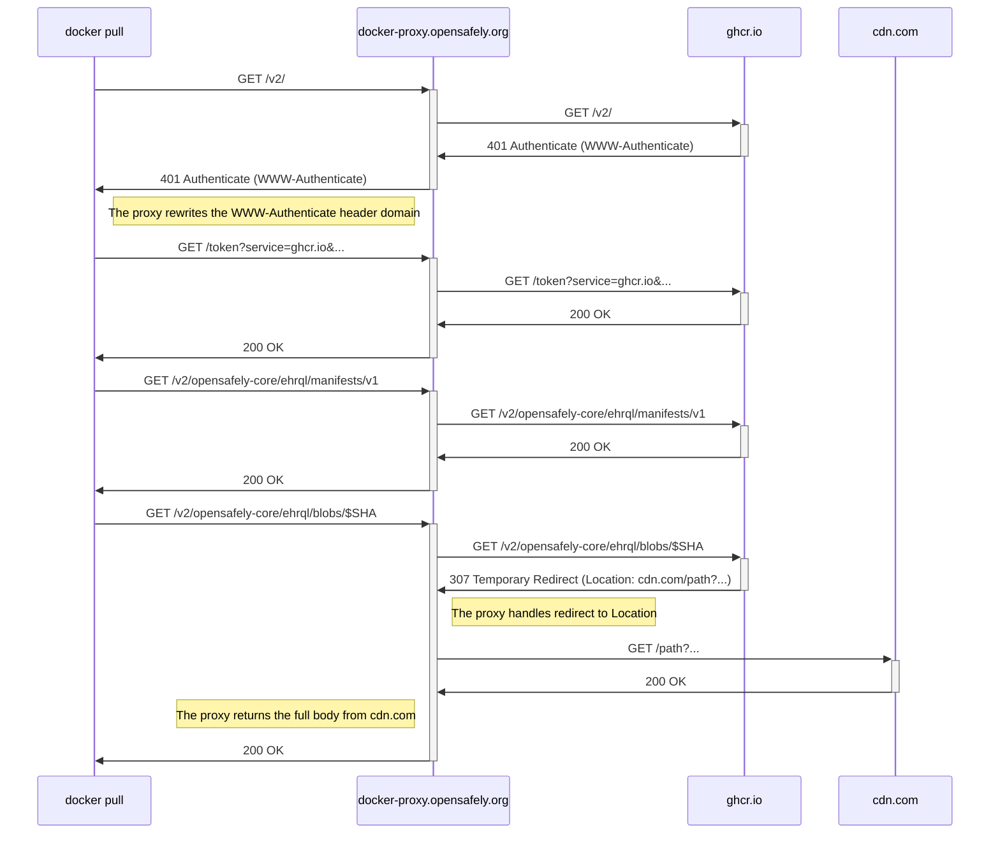

## Docker API flow

### Direct API Flow: `docker pull ghrc.io/opensafely-core/ehrql:v1`

```mermaid
sequenceDiagram
    docker pull->>+ghcr.io: GET /v2/
    ghcr.io->>-docker pull: 401 Authenticate (WWW-Authenticate: ...)
    docker pull->>+ghcr.io: GET /token?service=ghcr.io&...
    ghcr.io->>-docker pull: 200 OK
    docker pull->>+ghcr.io: GET /v2/opensafely-core/ehrql/manifests/v1
    ghcr.io->>-docker pull: 200 OK
    docker pull->>+ghcr.io: GET /v2/opensafely-core/ehrql/blobs/$SHA
    ghcr.io->>-docker pull: 307 Temporary Redirect (Location: cdn.com/path?...)
    docker pull->>+cdn.com: GET /path?...
    cdn.com->>-docker pull: 200 OK
```

### Proxied API Flow: `docker pull docker-proxy.opensafely.org/opensafely-core/ehrql:v1`

```mermaid
sequenceDiagram
    docker pull->>+docker-proxy.opensafely.org: GET /v2/
    docker-proxy.opensafely.org->>+ghcr.io: GET /v2/
    ghcr.io->>-docker-proxy.opensafely.org: 401 Authenticate (WWW-Authenticate) 
    docker-proxy.opensafely.org->>-docker pull: 401 Authenticate (WWW-Authenticate)
    Note left of docker-proxy.opensafely.org: The proxy rewrites the WWW-Authenticate header domain
    docker pull->>+docker-proxy.opensafely.org: GET /token?service=ghcr.io&...
    docker-proxy.opensafely.org->>+ghcr.io: GET /token?service=ghcr.io&...
    ghcr.io->>-docker-proxy.opensafely.org: 200 OK
    docker-proxy.opensafely.org->>-docker pull: 200 OK
    docker pull->>+docker-proxy.opensafely.org: GET /v2/opensafely-core/ehrql/manifests/v1
    docker-proxy.opensafely.org->>+ghcr.io: GET /v2/opensafely-core/ehrql/manifests/v1
    ghcr.io->>-docker-proxy.opensafely.org: 200 OK
    docker-proxy.opensafely.org->>-docker pull: 200 OK
    docker pull->>+docker-proxy.opensafely.org: GET /v2/opensafely-core/ehrql/blobs/$SHA
    docker-proxy.opensafely.org->>+ghcr.io: GET /v2/opensafely-core/ehrql/blobs/$SHA
    ghcr.io->>-docker-proxy.opensafely.org: 307 Temporary Redirect (Location: cdn.com/path?...)
    Note right of docker-proxy.opensafely.org: The proxy handles redirect to Location
    docker-proxy.opensafely.org->>+cdn.com: GET /path?...
    cdn.com->>-docker-proxy.opensafely.org: 200 OK
    Note left of docker-proxy.opensafely.org: The proxy returns the full body from cdn.com
    docker-proxy.opensafely.org->>-docker pull: 200 OK
```
